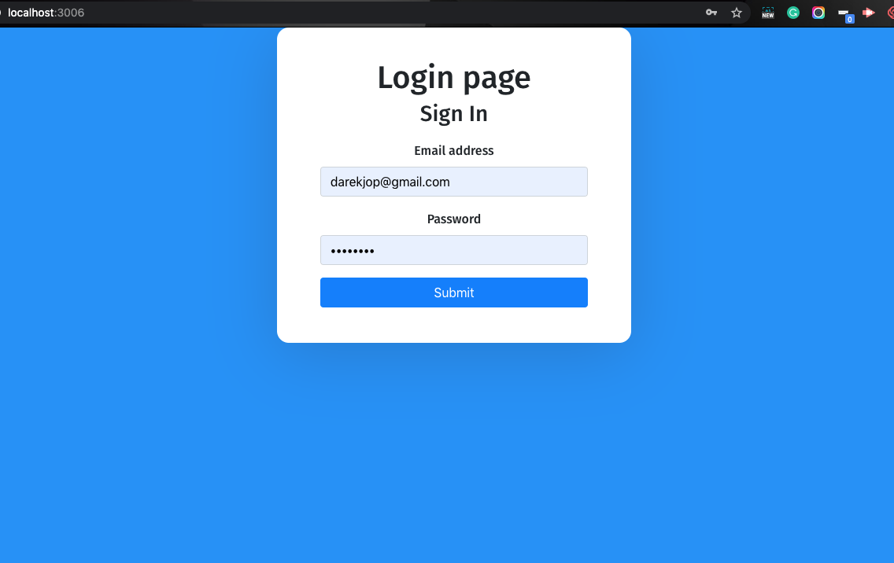
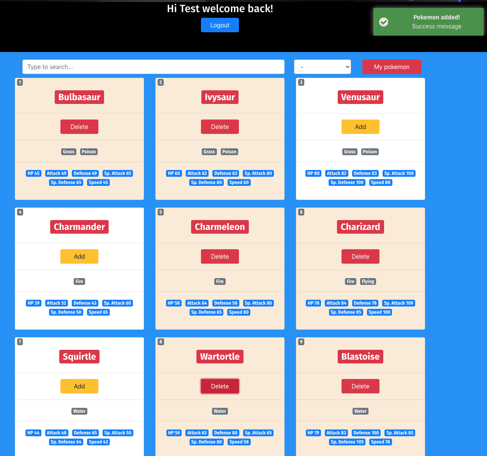

<h1> REACT FRONTENT POKEMON<H1>

##  HOW TO RUN APPLICTION
#### 
```sh
npm install
npm test
```
run locally you need to run first API project backend 
and change in index.js axios.defaults.baseURL to localhost 

axios.defaults.baseURL = 'http://localhost:3000/'
### Login page
 


### Pokemon page

 


### App is deployed below link 
## FrontEnd

https://pokemon-32.herokuapp.com/

## Backend


https://shrouded-woodland-17864.herokuapp.com/api/user/register

register user is only in api you can use postman to register new user
```sh
POST /api/user/register


---
(optional)
language - available languages : "english","japanese","chinese","french"
--

{
    "name": "Test",
    "email": "test@gmail.com",
    "password" : "password123"
    "language" : "english"
}
SUCCESSFUL RETURN :
{
    "language": "english",
    "_id": "5f6fa1db555fff57f2065314",
    "name": "Test",
    "email": "TEST@gmail.com",
    "password": "$2a$10$JuZa4Mle9ESchVZ4p5oZJONRYG8y56pxofge4Zhp8H/VEut5PzWIG",
    "date": "2020-09-26T20:17:31.812Z",
    "__v": 0
}
ERROR EXAMPLE:
Email already register
{
    "error": "Email already register"
}
wrong language
{
    "error": "Language not available"
}
Invalid password
{
    "error": "Invalid password"
}

```

